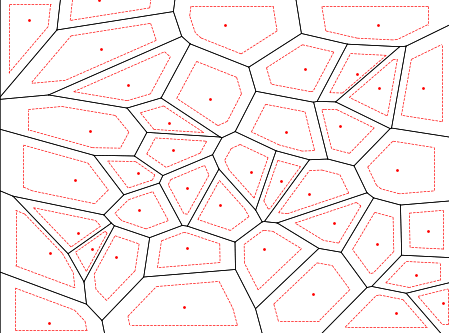

# Growing islands to approximate tessellations of the plane by Voronoi diagrams

BSc Thesis "Data Science & Artificial Intelligence", 2023

*This thesis received a grade of 9.0 (out of 10) in the Dutch grading system.*

Usage: `python3 growingislands [<input_file>]`.  

If no input file is provided, the program will generate a random tessellation and then approximate its generating points.

___

### Abstract

> _Voronoi diagrams are well-studied objects in the field of computational geometry. One problem related to Voronoi diagrams is the Inverse Voronoi problem where, given a tessellation of the plane into convex regions, we wish to find the points which could have generated the tessellation. Sometimes this is not possible, but it can be desirable to approximate the original tessellation by a Voronoi diagram. This paper presents a new algorithm for generating these approximations using a proposed definition for ”Voronoi-ness” of arbitrary tessellations, previously not well-defined in the literature. The results show that the algorithm does well on tessellations with mostly well-shaped and uniformly sized regions. The algorithm also marginally improves an existing solution for the approximation of territories of Tilapia mossambica by a Voronoi tessellation from 3.8% to 3.08%._

📃 Details & results can be found in the [paper](report.pdf).
